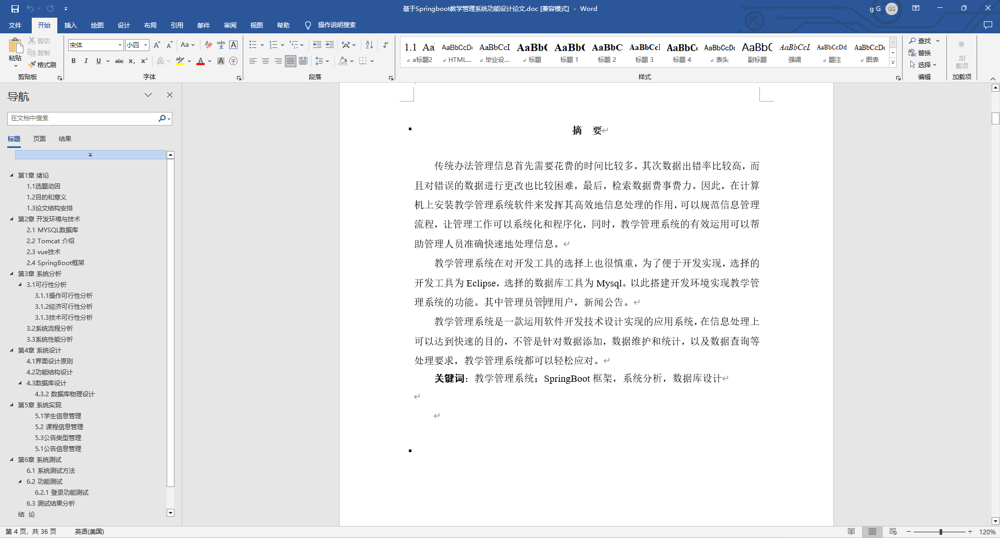
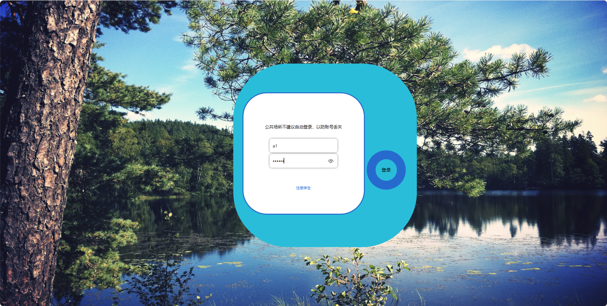
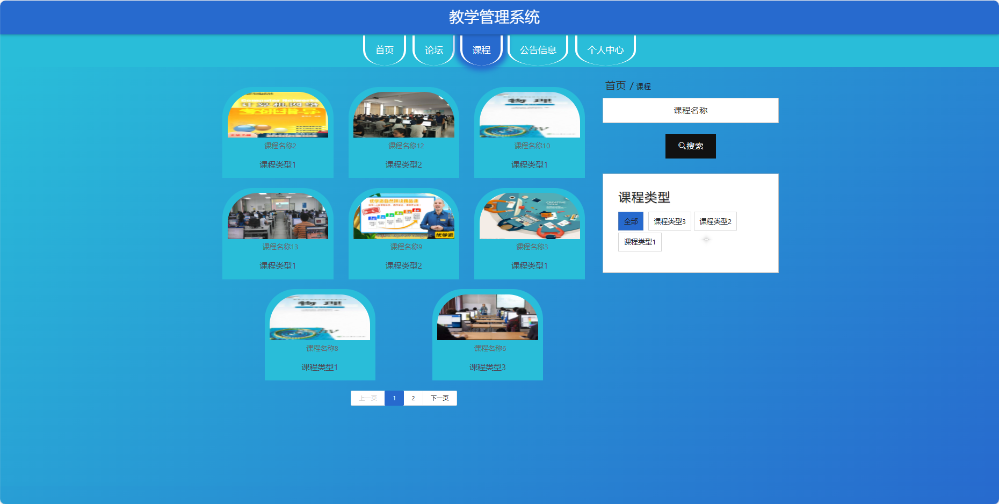
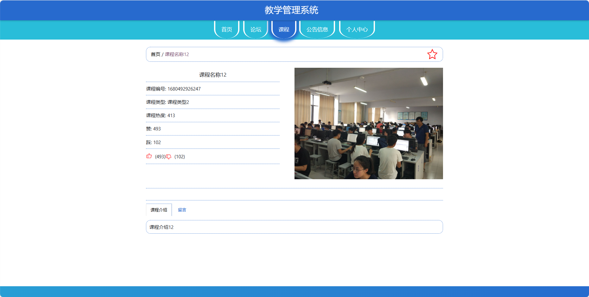
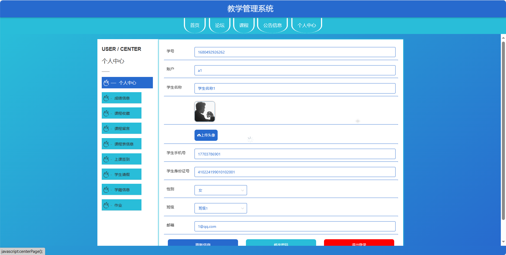
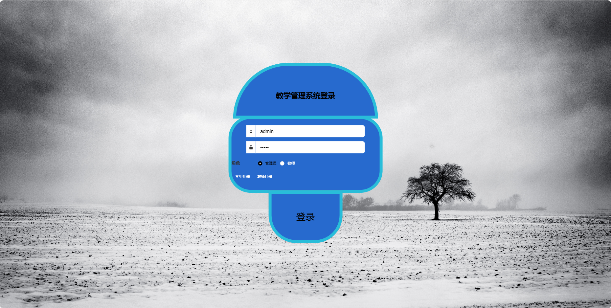
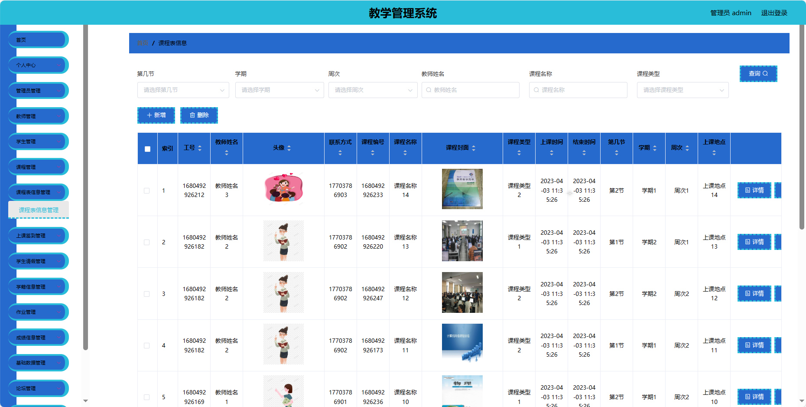
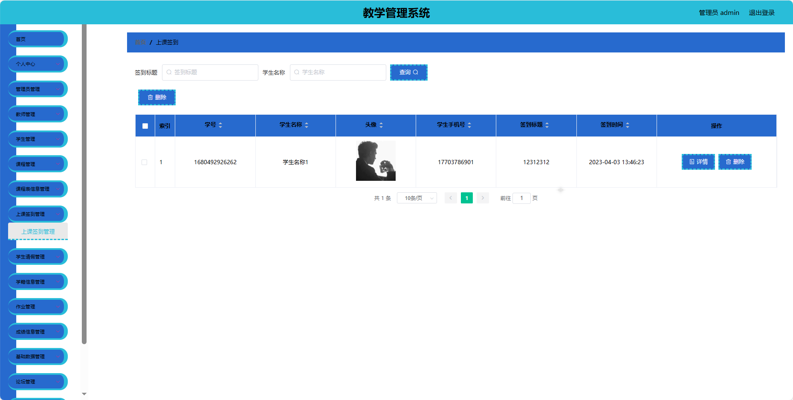
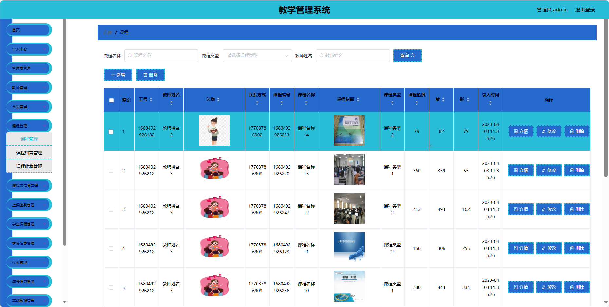
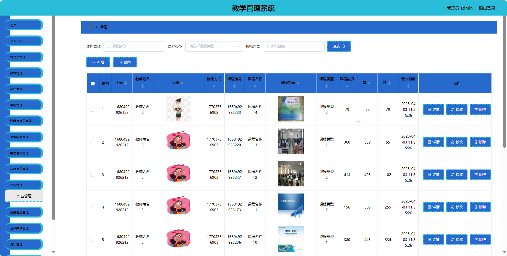

## 基于SpringBoot的教学管理系统(程序+报告)

###  获取sql数据库文件: 从戎源码网 (https://armycodes.com/) QQ: 386869957 QQ群: 377586148
###  所有系统地址: (https://github.com/YuLin-Coder/AllProjectCatalog) 
###  所有项目以及源代码本人均调试运行无问题 可支持远程安装部署调试、定制修改、代码讲解

## 项目介绍
基于SpringBoot的教学管理系统，系统包含三种角色：管理员、用户，教师主要功能如下。

### 【管理员】:
1. 首页：查看系统整体情况和关键信息。
2. 个人中心：管理管理员的个人信息。
3. 管理员管理：维护系统管理员的账户信息。
4. 教师管理：管理系统教师的信息和权限。
5. 学生管理：维护系统学生的账户信息。
6. 课程管理：管理系统的课程信息，增加、修改和删除。
7. 课程表信息管理：安排和管理课程的时间表信息。
8. 上课签到管理：记录和管理学生的上课签到情况。
9. 学生请假管理：处理学生请假请求。
10. 学籍信息管理：维护学生的学籍信息。
11. 作业管理：发布、查看和评价学生的作业。
12. 成绩信息管理：录入和查看学生成绩信息。
13. 基础数据管理：管理系统的基础数据，如课程类型等。
14. 论坛管理：管理在线论坛的帖子和回复。
15. 公告信息管理：发布、编辑和管理系统的公告信息。

### 【用户】:
1. 首页：浏览系统主要信息和最新动态。
2. 论坛：参与在线论坛，分享和获取信息。
3. 课程：查看课程相关信息和教学资源。
4. 公告信息：获取系统发布的公告信息。
5. 个人中心：管理个人信息。

### 【教师功能】
1. 首页：查看系统主要信息和最新动态。
2. 个人中心：管理教师的个人信息。
3. 学生管理：查看和管理自己所教授的学生信息。
4. 课程管理：管理自己教授的课程信息。
5. 上课签到管理：记录和管理学生的上课签到情况。
6. 学生请假管理：处理学生请假请求。
7. 课程表信息管理：查看和管理个人的课程表信息。
8. 学籍信息管理：查看和管理学生的学籍信息。
9. 作业管理：发布、查看和评价学生的作业。
10. 成绩信息管理：录入和查看学生成绩信息。
11. 论坛管理：管理在线论坛的帖子和回复。
12. 公告信息管理：发布、编辑和管理自己相关的公告信息。

## 项目技术
- 编程语言：Java
- 数据库：MySQL
- 项目管理工具：Maven
- 前端技术：HTML、CSS、JavaScript、Jquery、Vue
- 后端技术：Spring、SpringMVC、MyBatis

## 运行环境
- JDK版本：JDK1.8及以上
- 开发工具：IDEA、Ecplise、Myecplise都可以
- 数据库: MySQL5.7及以上
- Maven：maven3.0及以上
- Node：14.14.0及以上

## 运行截图

